<!-- PES University Campus Source - GitHub Enterprise README -->

  
  
  
  # 🎓 PES University Campus Source
  
  
  
  
  
  
  ### 🚀 *GitHub Enterprise for Academic Excellence*
  
  
  
  
  

---

<table align="center" width="100%">
<tr>
<td align="center" width="30%">
  
  ### 🏛️ **About Campus Source**
  *Centralized GitHub Enterprise Platform*
  
</td>
<td align="center" width="40%">
  
  **🎯 Serving 15,000+ Students, Faculty & Staff**
  
  Secure collaboration • Version control • Project management
  
</td>
<td align="center" width="30%">
  
  ### 🌟 **Excellence Through Innovation**
  *Empowering Academic Success*
  
</td>
</tr>
</table>

---

## 📊 **Platform Overview**

```mermaid
graph TD
    A[🏢 pestechnology Organization] --> B[👥 Program Teams]
    A --> C[👨‍🏫 Staff Teams]
    B --> D[💻 btech-cse]
    B --> E[🤖 btech-aiml] 
    B --> F[⚡ btech-ece]
    B --> G[🎓 mtech-programs]
    B --> H[💼 mba]
    C --> I[👨‍🏫 professors]
    C --> J[👩‍🏫 teaching-assistants]
    D --> K[📁 PESU-ProjectName-P01]
    E --> L[📁 PESU-ProjectName-P02]
    F --> M[📁 PESU-ProjectName-P03]
    
    style A fill:#1a472a,stroke:#2d5a3d,color:#fff
    style B fill:#f4a261,stroke:#e76f51,color:#fff
    style C fill:#f4a261,stroke:#e76f51,color:#fff
```

---

<table>
<tr>
<td width="50%">

## 🚀 **What We Enable**

### 🎓 **Academic Excellence**
- **Course Projects** - Collaborative assignments and coursework
- **Capstone Development** - Final year and research projects
- **Code Reviews** - Peer learning and quality assurance
- **Version Control** - Professional development workflows

### 🔬 **Research Innovation** 
- **Faculty Research** - Cutting-edge scientific investigations
- **Student Research** - Undergraduate and graduate projects
- **Interdisciplinary Collaboration** - Cross-department initiatives
- **Open Source Contributions** - Global research community participation

### 🏢 **Institutional Growth**
- **Administrative Tools** - Campus management applications
- **Infrastructure Projects** - Technology platform development
- **Industry Partnerships** - External collaboration projects
- **Startup Incubation** - Entrepreneurship support and development

</td>
<td width="50%">

## 📈 **Impact Metrics**

| 🏆 **Achievement** | 📊 **Numbers** |
|:---|---:|
| 👥 **Active Users** | **15,000+** |
| 📚 **Repositories** | **5,000+** |
| 🎯 **Projects Completed** | **2,500+** |
| 🏫 **Program Teams** | **20+** |
| ⚡ **Platform Uptime** | **99.9%** |
| 🔒 **Security Incidents** | **0** |

### 🎯 **Success Stories**

> 🏆 **AI-Powered Healthcare Platform**  
> *Winner of National Innovation Challenge 2024*

> 🌱 **Smart Campus IoT System**  
> *Implemented across all PES campuses*

> 📱 **Fintech Mobile App**  
> *10,000+ downloads, featured in app stores*

> 🔬 **ML Research Publications**  
> *50+ papers with open-source repositories*

</td>
</tr>
</table>

---

## 🛠️ **Getting Started Guide**

### 🎯 **Choose Your Path**

<table>
<tr>
<td width="33%" align="center">

### 👩‍🎓 **Students**

Sign up with your `@pes.edu` email

Accept "pestechnology" invitation

Set up two-factor authentication

Add program & department info

</td>
<td width="33%" align="center">

### 👨‍🏫 **Faculty**

Create account with PES credentials

Join professors and program teams

Create and manage repositories

Mandatory security awareness

</td>
<td width="33%" align="center">

### 👥 **Staff**

Connect to administrative systems

Set up communication tools

Configure security settings

Connect to university systems

</td>
</tr>
</table>

---

## 🎓 **Educational Programs**

### 🏆 **Skill Development & Certification**

<table>
<tr>
<td align="center" width="25%">

### 📖 **GitHub Bootcamp**
*4-Week Intensive Program*

**Curriculum:**
- Git Fundamentals
- GitHub Collaboration  
- Branching & Merging
- Advanced Features

</td>
<td align="center" width="25%">

### 🔍 **Code Review Workshops**
*Professional Development*

**Topics:**
- Review Standards
- Collaborative Workflows
- Quality Assurance
- Team Communication

</td>
<td align="center" width="25%">

### 🔒 **Security Training**
*Cybersecurity Awareness*

**Coverage:**
- Secure Coding
- Threat Awareness
- Incident Response
- Policy Compliance

</td>
<td align="center" width="25%">

### 🏅 **Certification Program**
*Industry Recognition*

**Benefits:**
- Resume Enhancement
- Skill Validation
- Career Advancement
- Portfolio Building

</td>
</tr>
</table>

---

## 🔐 **Security & Compliance Excellence**

<table>
<tr>
<td width="50%">

### 🛡️ **Security Features**

- ✅ **Mandatory 2FA** - All users require two-factor authentication
- 🔐 **Branch Protection** - Automated rules on all repositories  
- 🔍 **Security Scanning** - Automated vulnerability detection
- 📊 **Regular Audits** - Quarterly permissions and access reviews
- 🚨 **Incident Response** - 24/7 security event monitoring

### 🚨 **Emergency Contact**
**Security Emergency Hotline**
- 📧 `security-emergency@pes.edu`
- 📞 `+91-80-2677-2534` (24/7)

</td>
<td width="50%">

### 📋 **Compliance Standards**

| 📜 **Policy** | 🔗 **Link** |
|:---|:---:|
| 🛡️ **Security Best Practices** |  |
| 📋 **Acceptable Use Policy** |  |
| 👥 **Team Management** |  |
| 📠**Academic Integrity** |  |

### 🏆 **Security Achievements**
- 🥇 **Zero Security Incidents** in 2024
- 🔒 **100% 2FA Adoption** across all users
- ⚡ **<5 minute** average incident response time
- 🛡️ **ISO 27001 Compliant** security framework

</td>
</tr>
</table>

---

## 🌟 **Innovation Showcase**

### 🚀 **Where Innovation Meets Collaboration**

<table>
<tr>
<td align="center" width="25%">

### 🌐 **Digital Transformation**

Campus-wide technology modernization through cloud adoption and process automation

**Impact:** 40% efficiency improvement

</td>
<td align="center" width="25%">

### 🤖 **AI/ML Excellence**

Advanced research center with 50+ published papers and open-source contributions

**Impact:** 200+ research projects

</td>
<td align="center" width="25%">

### 🏗️ **Smart Campus**

IoT-enabled intelligent infrastructure across all campus locations

**Impact:** 30% energy savings

</td>
<td align="center" width="25%">

### 🌱 **Sustainability**

Green technology solutions and environmental impact reduction initiatives

**Impact:** Carbon neutral by 2025

</td>
</tr>
</table>

---

## 📞 **24/7 Support & Resources**

<table>
<tr>
<td align="center" width="33%">

### 📧 **Email Support**

Professional IT support for all Campus Source related queries and technical assistance.

**Response Time:** < 1 hour

</td>
<td align="center" width="33%">

### 📞 **Phone Support**

Direct phone support available 24/7 for urgent issues and immediate assistance.

**Availability:** 24/7

</td>
<td align="center" width="33%">

### 🏢 **In-Person Help**

Ground Floor, Main Building  
Monday-Friday: 9:00 AM - 5:00 PM

**Walk-in Support Available**

</td>
</tr>
</table>

---

## 🔗 **Quick Navigation**

---

## 🎯 **Our Mission**

> ### *"To empower the PES University community through innovative technology solutions, exceptional support services, and robust infrastructure that enhances teaching, learning, research, and administrative operations."*

---

<table align="center" width="100%">
<tr>
<td align="center">

### 🌍 **Connect With PES University**

</td>
</tr>
</table>

---

## ✨ **Campus Source: Where Innovation Meets Collaboration**

### *Made with ❤️ by PES University Information Systems & Technology*

---

*Last Updated: December 2024 | Version 2.0*

